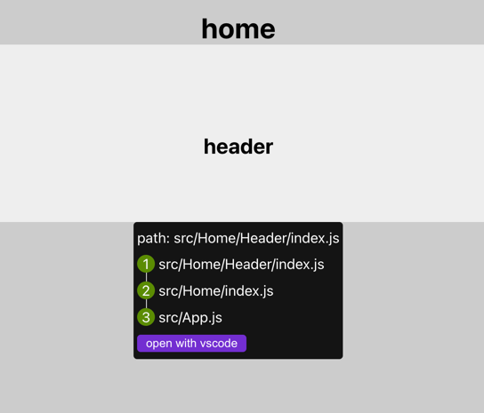

# react-location
Quickly helps developers locate the source code position of any element on a page and its file dependencies.

Usage
```shell
npm install react-location 
```
```javascript
import initLocation from 'react-location';

initLocation();
```


